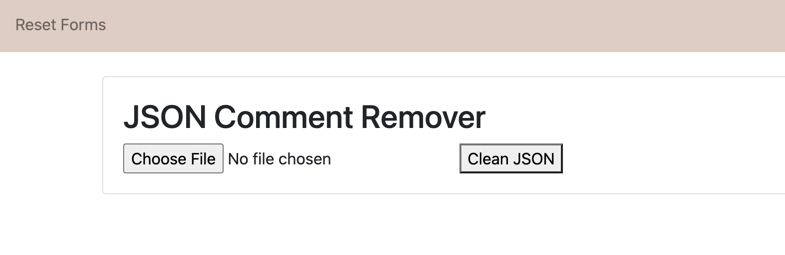
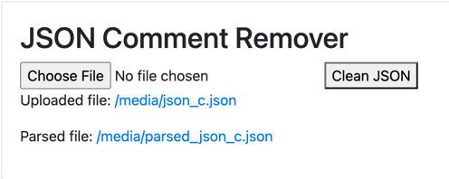

# customjsonparser

### Description

This parser takes json files with comments in them and removes the comments. 

### Design
- Dockerized Django that runs a JSON parser
- Json Parser : [customjsonparser/jsons/json_parser.py](https://github.com/stephjaelee/customjsonparser/blob/main/jsons/json_parser.py)


### Steps:
1. copy the repo into a folder
```commandline
git clone https://github.com/stephjaelee/customjsonparser.git
```
2. run docker
```commandline
docker-compose up
```
3. go to 
  - http://0.0.0.0:8000/jsons/upload/
  - This should take you to:
  - 
4. Click Choose File and select the sample json in this repo
    - ./sample_json/json_c.json
5. Upload the file and press the clean JSON button
    - This should return:
    - 
6. Clicking the link will take you to the parsed json or original json
